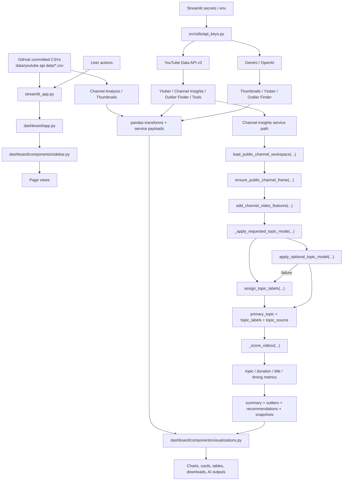
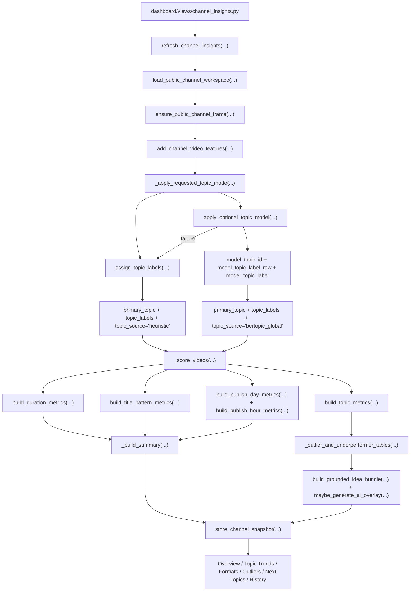
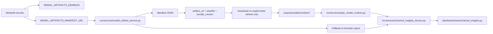
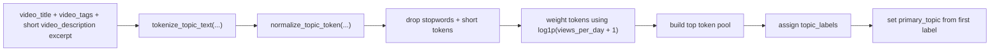
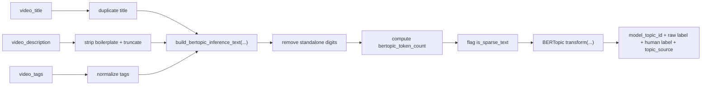

# YouTube IP V5 Architecture

## Sidebar Navigation

1. `Channel Analysis`
2. `Channel Insights`
3. `Thumbnails`
4. `Outlier Finder`
5. `Ytuber`
6. `Tools`
7. `Deployment`

V5 removes the sidebar `Assistant` and removes Google OAuth from `Channel Insights`.

## Full Runtime And Data Pipeline

## Page Problem Map

| Page | Problem Solved | Main Services / Inputs | Main UI Outputs | Interlinks |
| --- | --- | --- | --- | --- |
| `Channel Analysis` | benchmark bundled datasets | CSVs, pandas, visualization helpers | KPI cards, trend charts, ranked tables | shares benchmark context with `Thumbnails` |
| `Channel Insights` | analyze one tracked public channel over time | `public_channel_service`, `channel_snapshot_store`, `channel_insights_service`, optional BERTopic | topic trends, format analysis, outliers, next-topic ideas | can inform `Outlier Finder` themes |
| `Thumbnails` | generate or export thumbnails without mixing broader strategy UI | `thumbnail_generator.py`, `thumbnail_hub_service.py`, public thumbnail URLs | generated thumbnails, preview cards, downloadable images | lighter replacement for the old recommendations surface |
| `Outlier Finder` | find niche winners | `outliers_finder.py`, `outlier_ai.py`, YouTube API | scored outlier tables, breakout snapshot, AI research | receives handoff from `Ytuber` and `Channel Insights` |
| `Ytuber` | run a live creator AI workspace | YouTube API, pooled API keys, thumbnail generator | AI Studio, audit views, keyword and planner outputs | can hand off into `Outlier Finder` |
| `Tools` | export public YouTube assets | `youtube_tools.py`, `transcript_service.py`, `yt-dlp`, `ffmpeg` | metadata previews, transcript/audio/video/thumbnail downloads | standalone utility surface |
| `Deployment` | explain setup and deployment | static instructions in app shell | repo, branch, secrets, deploy notes | operational reference only |

## Live API Extraction Flow

```mermaid
flowchart LR
    A["User enters channel, keyword, or URL"] --> B["Page view"]
    B --> C["src/utils/api_keys.py"]
    C --> D["Selected provider key"]
    D --> E["YouTube Data API request"]
    E --> F["Service-layer normalization"]
    F --> G["pandas dataframes / scored payloads"]
    G --> H["dashboard/components/visualizations.py"]
    H --> I["Rendered Streamlit UI"]
```

In V5, `Channel Insights` is public-only. It does not use Google OAuth and it does not merge owner-only YouTube Analytics metrics.

## Channel Insights Topic Integration

The base `Channel Insights` dataframe is built the same way regardless of topic mode:

1. `load_public_channel_workspace(...)`
2. `ensure_public_channel_frame(...)`
3. `add_channel_video_features(...)`
4. `_apply_requested_topic_mode(...)`

After that, both topic modes feed the same downstream metrics, scoring, outlier detection, idea generation, and snapshot persistence.

### Topic Outputs That Persist

- `primary_topic` is the row-level theme key used in topic metrics and UI explanations.
- `topic_labels` stores the per-video label list used for grouping and later inspection.
- `topic_source` records whether the row came from heuristics or BERTopic beta.
- summary JSON and insight payloads persist:
  - `topic_mode_requested`
  - `topic_mode_used`
  - `topic_model_status`
  - `topic_model_bundle_version`
  - `topic_model_failure_reason`

## Model-Backed Topic Flow

Topic modes:

- `Heuristic Topics` uses built-in keyword and rule grouping
- `Model-Backed Topics` uses optional BERTopic semantic grouping

### Heuristic Topic Derivation

### BERTopic Beta Preprocessing

## Branch Notes

- V5 removes the global `Assistant`
- V5 removes Google OAuth and owner-only analytics overlays
- V5 renames page 3 to `Thumbnails`
- BERTopic is optional and never required at app boot
