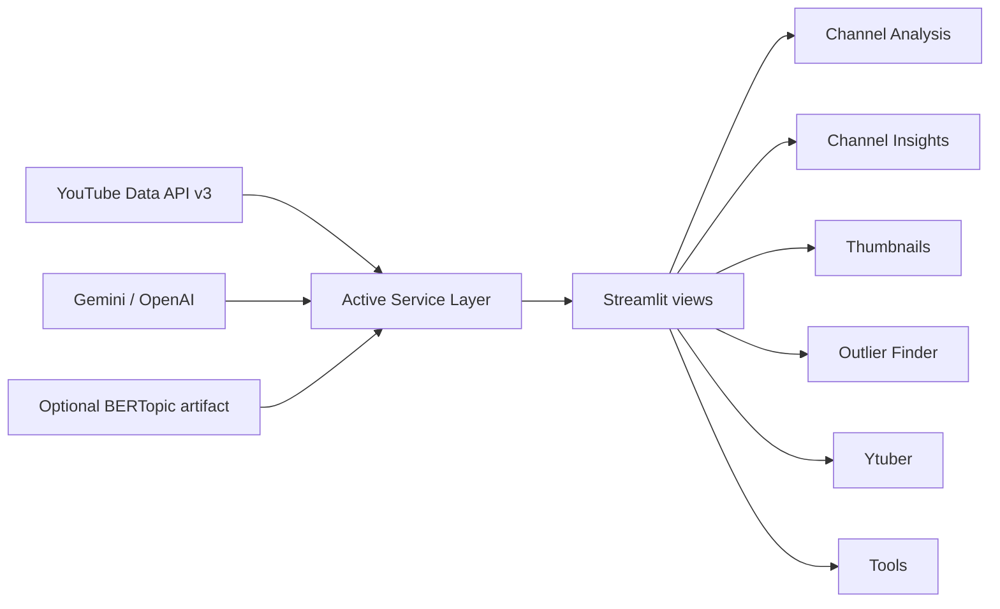

# YouTube IP V4 Architecture

## Runtime Surface

The deployable app keeps a simplified core while preserving the separate AI suite pages that still matter to the workflow.

Primary sidebar order:

1. `Channel Analysis`
2. `Channel Insights`
3. `Thumbnails`
4. `Outlier Finder`

Additional runtime pages:

5. `Ytuber`
6. `Tools`
7. `Deployment`

## Runtime Flow

The Streamlit entrypoint remains:

- `streamlit_app.py`

The routed app shell lives in:

- `dashboard/app.py`
- `dashboard/components/sidebar.py`

## Current Product Shape

### Channel Analysis

- Reads committed CSV datasets from `data/youtube api data/`
- Supports portfolio-style benchmarking, filters, KPI summaries, and top performer tables

### Channel Insights

- Public-channel snapshot workflow only
- Resolves a channel from URL, handle, or ID through the YouTube Data API
- Stores local snapshot history in SQLite under `outputs/channel_insights/`
- Computes topic, format, title pattern, outlier, and next-topic insights
- Supports optional BERTopic beta mode through an external artifact manifest

### Thumbnails

- Thumbnail-only workspace
- AI thumbnail generation with Gemini or OpenAI
- Public thumbnail preview/export from a YouTube video URL or video ID
- Stores generated images under `outputs/thumbnails/`

### Outlier Finder

- Niche and outlier discovery workflow
- Uses public YouTube API search plus internal scoring and optional AI explanation

### Ytuber

- AI suite workspace for creator ideation, planning, and channel review flows
- Remains available as a standalone page

### Tools

- Creator utility workspace for metadata, thumbnail, transcript, audio, and video operations
- Still depends on `yt-dlp`, `youtube-transcript-api`, and `ffmpeg`

## Service Layer

Active runtime services are concentrated under `src/services/`:

- `channel_insights_service.py`
- `channel_snapshot_store.py`
- `public_channel_service.py`
- `topic_analysis_service.py`
- `topic_model_runtime.py`
- `model_artifact_service.py`
- `thumbnail_hub_service.py`
- `outliers_finder.py`
- `outlier_ai.py`

Shared utilities remain under `src/utils/`.

Thumbnail image generation continues to use:

- `src/llm_integration/thumbnail_generator.py`

## External Dependencies

### Required

- YouTube Data API v3 for public channel and niche data
- Gemini or OpenAI keys for optional AI features

### Optional

- BERTopic artifact manifest for experimental model-backed topic clustering in `Channel Insights`

BERTopic artifacts are never committed into the repo and are never loaded during app boot. If the artifact is missing or unavailable, the app falls back to heuristic topic analysis.

## Model-Backed Topic Flow

```mermaid
flowchart LR
    A["Streamlit secrets"] --> B["MODEL_ARTIFACTS_MANIFEST_URL"]
    B --> C["src/services/model_artifact_service.py"]
    C --> D["Manifest JSON"]
    D --> E["Artifact URL + checksum"]
    E --> F["outputs/models/runtime/<bundle_version>/"]
    F --> G["src/services/topic_model_runtime.py"]
    G --> H["src/services/channel_insights_service.py"]
    H --> I["dashboard/views/channel_insights.py"]
```

## Deployment Rules

- Keep `streamlit_app.py` unchanged as the deployment entrypoint
- Keep routing inside `dashboard/app.py`
- Do not require Google OAuth or owner-only analytics secrets
- Do not make startup depend on optional model artifacts

This build still includes the `Tools` page, so:

- `packages.txt` continues to install `ffmpeg`
- runtime dependencies still include `yt-dlp` and `youtube-transcript-api`

## Removed From Runtime

This cleaned V4 build intentionally excludes:

- the sidebar Assistant
- Google OAuth
- owner-only YouTube Analytics metrics

## Archived Material

Legacy research assets and older modeling material remain outside the runtime path under:

- `research_archive/`

Those assets are preserved for reference, but they are not part of the Streamlit deployment contract.
