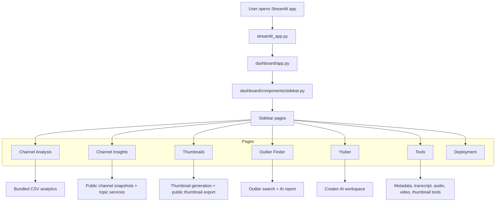
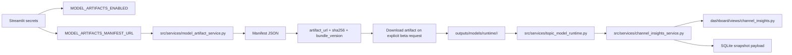

# Deployment, Model Flow, And Version Notes

## Branch Tag

- Original repo branch tag: `youtube-ip-v5`
- Original repo: `matt-foor/purdue-youtube-ip`
- Deploy repo: `royayushkr/Youtube-IP-V5`
- Deploy branch: `main`

## How The App And Scripts Work Together



## How Model-Backed Topics Are Actually Deployed

The BERTopic-backed topic mode is optional and is activated through Streamlit secrets.



### Streamlit Secrets Block

```toml
YOUTUBE_API_KEYS = ["your_youtube_key_1", "your_youtube_key_2"]
GEMINI_API_KEYS = ["your_gemini_key_1", "your_gemini_key_2"]
OPENAI_API_KEYS = ["your_openai_key_1", "your_openai_key_2"]

MODEL_ARTIFACTS_ENABLED = true
MODEL_ARTIFACTS_MANIFEST_URL = "https://raw.githubusercontent.com/royayushkr/Youtube-IP-V5/main/data/model_manifests/bertopic_manifest_2026.03.27.json"
MODEL_ARTIFACTS_CACHE_DIR = "outputs/models/runtime"
MODEL_ARTIFACTS_DOWNLOAD_TIMEOUT_SECONDS = 300
MODEL_ARTIFACTS_MAX_SIZE_MB = 512
```

### What The Manifest Does

The secret points to a manifest JSON file in the deploy repo. That manifest then defines:

- the external `artifact_url`
- the expected `sha256`
- the `bundle_version`
- the loading subpath for the runtime service

In this branch, the checked-in manifest currently points to the external BERTopic artifact hosted from the `asher` artifact source. The app reads the manifest first, then downloads and validates the artifact lazily only when beta topic mode is requested.

## V4 Vs V5

| Area | V4 (`youtube-ip-v4`) | V5 (`youtube-ip-v5`) |
| --- | --- | --- |
| Sidebar Assistant | Present | Removed |
| Google OAuth | Present | Removed |
| Channel Insights | Public + owner overlays when authorized | Public-only |
| Recommendations page | Present as `Recommendations` | Renamed in-app to `Thumbnails` |
| Ytuber | Present | Present |
| Tools | Present | Present |
| Deployment page | Present | Present |
| BERTopic beta | Optional | Optional |
| Deploy repo | `royayushkr/Youtube-IP-V4` | `royayushkr/Youtube-IP-V5` |

## What To Use When

- Use `youtube-ip-v4` if you want the fullest legacy product surface, including the Assistant and Google OAuth owner analytics.
- Use `youtube-ip-v5` if you want the lighter shell and public-only Channel Insights while still keeping the AI suite pages.
